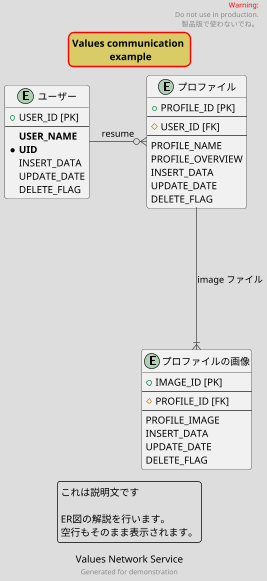

<!--
title:   VSCodeで書くPlantUML ER図 (ER図からコードへジャンプやテーマ、画像拡大縮小も大幅に便利に )
tags:    ER図,VSCode,plantuml
id:      f8357fc7d17456738e93
private: false
-->

# 関連記事

PlantUML入門 ER図を書く基本 for VSCode - Qiita

https://qiita.com/masakinihirota/items/da14aceff7f003ed0ef5

PlantUMLでER図を書く文法を知りたい場合は↑この記事を参照してください。

↑の記事を書いた時よりも、より便利なVSCodeの拡張機能が使えるようになっていたり、デフォルトのテーマが変わってたりしていたので、その辺りを調べた事を書きました。

# QiitaでPlantUMLの図を書く

` ```plantuml ` と` ``` `で囲むとその中に書いたPlantUMLのコードがQiita上でER図になります。


# ER図を書く技術

PlantUMLファイルで自分が使っている拡張子
 *.puml

PlantUMLのER図をプレビュー
Alt+Dキー

詳細は、↓の記事を参照してください。

PlantUML入門 ER図を書く基本 for VSCode - Qiita

https://qiita.com/masakinihirota/items/da14aceff7f003ed0ef5


## ER図作成例



※↑Qiitaの機能でPlantUMLのER図が表示できています。
↓そのコードです。

```example.puml

@startuml example05

' テーマ (コメントアウトを外して使う)
!theme toy
' !theme vibrant
' !theme _none_


' 拡大縮小
scale 0.7

' タイトル
title Values communication \n example
skinparam titleBorderRoundCorner 15
skinparam titleBorderThickness 2
skinparam titleBorderColor red
skinparam titleBackgroundColor #d9cb65


entity "ユーザー" as users {
' 丸記号
+ USER_ID [PK]
--
' 強調文字
**USER_NAME**
' 丸記号＋強調文字
* **UID**
INSERT_DATA
UPDATE_DATE
DELETE_FLAG
}

entity "プロファイル" as profiles {
+ PROFILE_ID [PK]
--
' ダイヤ記号
# USER_ID [FK]
--
PROFILE_NAME
PROFILE_OVERVIEW
INSERT_DATA
UPDATE_DATE
DELETE_FLAG
}

entity "プロファイルの画像" as profile_images {
+ IMAGE_ID [PK]
--
# PROFILE_ID [FK]
--
PROFILE_IMAGE
INSERT_DATA
UPDATE_DATE
DELETE_FLAG
}

' コメント：配置方法
users --right--o{ profiles : resume
profiles --down--|{ profile_images : image ファイル

' ヘッダー
header
<font color=red>Warning:</font>
Do not use in production.
製品版で使わないでね。
endheader

' フッター
center footer Generated for demonstration

' キャプション(見出し)
caption Values Network Service

' legend(説明文)
legend
' legend top right
' legend left
これは説明文です

ER図の解説を行います。
空行もそのまま表示されます。
endlegend

@enduml

```


# ビューワー(VSCode拡張機能)

今回は↓この拡張機能を使います。

PlantUML - Simple Viewer
v2.17.6
well-ar
43,816
(4)

以前は↓こちらを使っていました。

PlantUML
v2.17.5
jebbs
1,557,930
(93)

※一番ダウンロード数が多いですが、ER図からコードにジャンプする機能がないので採用を見送りました。
これを使っていた頃は他のライブラリをインストールとか、ER図の描写が遅かったりとか、反応がなかったりとか、拡大縮小がおかしかったりとか、いろいろ不満な点が多々ありました。


## VSCodeマーケットプレイス

PlantUML - Simple Viewer - Visual Studio Marketplace

https://marketplace.visualstudio.com/items?itemName=well-ar.plantuml

Alt + Dキーでプレビューが表示されます。

ER図のテキストをクリックすると、現在のエディタウィンドウ上の該当コードにフォーカスが合わされます。つまり、ER図からコードに簡単に移動できるため、巨大なER図でもコードに戻ることが容易になります。

機能
* プレビュー図の表示。PlantUMLプレビューを開始するには、Alt + D を押します。

	* 自動更新。
	* ズームとスクロールのサポート。
	* 複数ページの図のサポート。
	* インスタントプレビュー。図がエクスポートされている場合は、すぐにプレビューが表示されます。
	* ローカルまたはサーバーからのエクスポート。
	* 境界線にスナップ。


* 図のエクスポート。
	* カーソル位置、現在のファイル、ワークスペース全体、選択したワークスペースでエクスポートできます。
	* 同時エクスポート。
	* URLの生成。
	* 複数ページの図のサポート。
	* ローカルまたはサーバーからのエクスポート。
	* 画像マップ（cmapx）のサポート。

* 編集サポート。
	* PlantUMLコードのフォーマット。 (非推奨)
	* すべてのタイプの構文のハイライト。
	* すべてのタイプのスニペット。
	* 基本的な自動補完とマクロのシグネチャサポート。
	* シンボルリストのサポート。

その他

* マルチルートワークスペースのサポート。
* MarkDownの統合サポート。デモを表示
* 画像からソースを抽出するサポート。

※注意：カスタマイズしたplantuml.jarを使用している場合は、最新バージョンに更新して、複数ページの図のサポートを有効にしてください。（V1.2017.15以降）
PlantUMLコードのフォーマットは非推奨です。正しく動作する場合にのみ使用し、自動フォーマットの場合（保存時のフォーマット）には強制的に無効になっています。


# テーマ

PlantUMLはテーマも更新され大変見やすくなりました。
黄色と灰色、赤のPlantUMLのイメージは消え、汎用的なテーマカラーがデフォルトになりました。

テーマはPlantUMLのコードの先頭に記述します。

自分の好みのテーマ
* ダークモードで使用しても大丈夫
* ダークモードでも図や文字が見やすい
* 目が疲れにくい
* 奇妙のな色を使っていない

自分が選んだ3つのテーマ

```
' !theme toy
' !theme vibrant
' !theme _none_
```

テーマの使い方 (↑コメントアウトを外して使う)
!theme toy

コメントアウトは「'」を先頭につける。
コメントアウトの例
' !theme amiga

※注意 2つのテーマを同時に使うと両方のテーマが上書きか、反映がされます。

## テーマギャラリー

このページ全てのテーマの使用例があります。

https://the-lum.github.io/puml-themes-gallery/

※全テーマの使用例を1ページに収めているので超巨大ページになっています、開く時に注意してください。

## 公式のテーマ一覧

theme _none_
theme amiga
theme aws-orange
theme black-knight
theme bluegray
theme blueprint
theme carbon-gray
theme cerulean
theme cerulean-outline
theme cloudscape-design
theme crt-amber
theme crt-green
theme cyborg
theme cyborg-outline
theme hacker
theme lightgray
theme mars
theme materia
theme materia-outline
theme metal
theme mimeograph
theme minty
theme plain
theme reddress-darkblue
theme reddress-darkgreen
theme reddress-darkorange
theme reddress-darkred
theme reddress-lightblue
theme reddress-lightgreen
theme reddress-lightorange
theme reddress-lightred
theme sandstone
theme silver
theme sketchy
theme sketchy-outline
theme spacelab
theme spacelab-white
theme superhero
theme superhero-outline
theme toy
theme united
theme vibrant


↓テーマは人それぞれ好みの問題なので折りたたみます。

<details><summary>テーマの選別</summary>

テーマ選別の結果
最終結果
この3つを使ってみることにしました。

' !theme toy
' !theme vibrant
' !theme _none_

----------------------------------------

テーマ選別の結果

' !theme toy
' !theme vibrant
' !theme _none_
	' !theme amiga
	' !theme blueprint
	' !theme cloudscape-design
	' !theme crt-green
	' !theme lightgray
	' !theme metal
	' !theme reddress-darkblue
	' !theme reddress-darkgreen
	' !theme reddress-darkorange
	' !theme reddress-darkred

※タブでインデントを下げているのは使えそうだけど自分の好みではなかったもの。

</details>


# 参考

PlantUML入門 ER図を書く基本 for VSCode - Qiita

https://qiita.com/masakinihirota/items/da14aceff7f003ed0ef5

QiitaでPlantUMLが使えるようになっていた - Qiita

https://qiita.com/kazuki43zoo/items/d23148c149f4d31d2521
